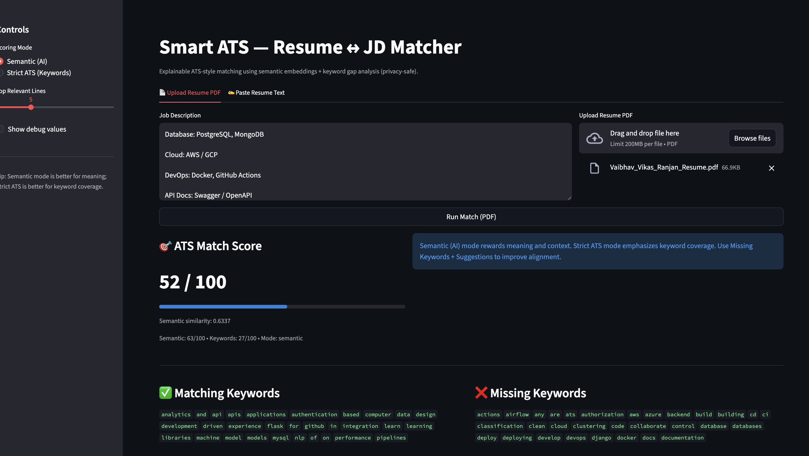
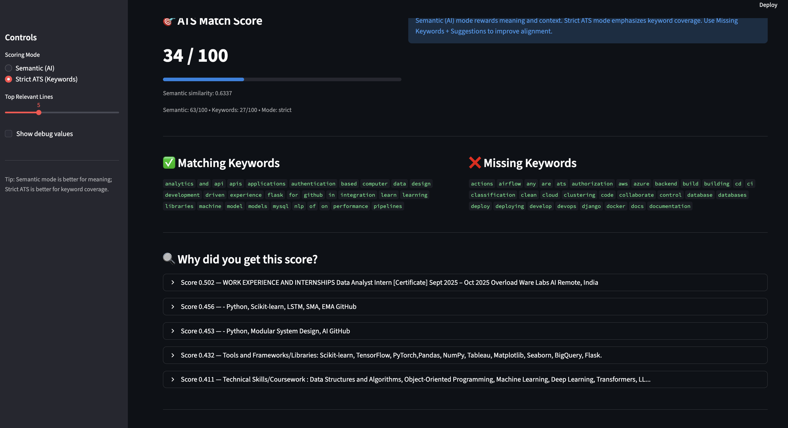

# Smart ATS — Resume ↔ Job Description Matcher

Smart ATS is an **explainable AI-powered Applicant Tracking System (ATS)** that evaluates how well a resume matches a job description using **semantic similarity + keyword-based scoring**.

Unlike traditional ATS tools, it explains *why* a resume scored the way it did and provides **actionable suggestions** to improve alignment.

---

## 🚀 Problem Statement

Recruiters receive hundreds of resumes per job opening, while candidates struggle to understand why their resumes get rejected by ATS systems.

Most ATS tools are:
- Keyword-heavy and opaque  
- Poor at understanding context and semantics  
- Unhelpful for candidates trying to improve their resumes  

---

## 💡 Solution

Smart ATS combines **modern NLP embeddings** with **traditional ATS keyword logic** to deliver:
- Transparent scoring  
- Clear explanations (top contributing resume lines)  
- Skill gap analysis (missing keywords)  
- Resume improvement guidance (suggestions)  

It supports **two scoring modes** to simulate real-world ATS behavior.

---

## ✨ Key Features

- 🔍 **Semantic Resume–JD Matching** using SentenceTransformers  
- 🧠 **Explainable Scoring** — shows the most relevant resume chunks driving the score  
- 📊 **Dual Scoring Modes**
  - **Semantic (AI)** — meaning & context focused  
  - **Strict ATS** — keyword coverage focused  
- 🧾 **Score Breakdown**
  - Semantic score  
  - Keyword score  
  - Final weighted ATS score  
- ❌ **Missing Keyword Detection** - 💡 **Actionable Resume Improvement Suggestions** - 🔐 **Privacy-Safe Resume Parsing**
  - Automatically redacts emails & phone numbers  
- 📄 **PDF Resume Support** - 🖥️ **Interactive Web UI** built with Streamlit  

---

## 📸 Screenshots

### Home & Input Interface

### Score Breakdown & Keyword Analysis

---

## 🏗️ Architecture

Streamlit UI
     |
     | (HTTP Requests)
     v
FastAPI Backend
     |
     |-- Resume Parsing (PDF/Text)
     |-- Semantic Embeddings (SentenceTransformers)
     |-- Keyword Analysis
     |-- Scoring Engine
     |-- Explainability Engine
---

## 🧪 Scoring Logic
Semantic Score: Computed using cosine similarity between resume and job description embeddings.

Keyword Score: Based on overlap between resume keywords and JD keywords (stopwords and generic terms filtered out).

Final ATS Score calculation:

Semantic Mode: 0.7 × Semantic Score + 0.3 × Keyword Score

Strict ATS Mode: 0.2 × Semantic Score + 0.8 × Keyword Score

## 🛠️ Tech Stack
Backend: FastAPI

Frontend: Streamlit

NLP: SentenceTransformers (all-MiniLM-L6-v2)

PDF Parsing: PyMuPDF

Language: Python

▶️ How to Run Locally
1️⃣ Clone the repository
git clone [https://github.com/](https://github.com/)<your-username>/smart-ats-resume-matcher.git
cd smart-ats-resume-matcher

2️⃣ Backend setup
cd backend
python3 -m venv venv
source venv/bin/activate  # On Windows use `venv\Scripts\activate`
pip install -r requirements.txt
uvicorn app.main:app --reload --reload-dir app

Backend runs at: http://127.0.0.1:8000

Interactive Docs: http://127.0.0.1:8000/docs

3️⃣ Run the UI
# Open a new terminal window
cd smart-ats-resume-matcher
source backend/venv/bin/activate
streamlit run ui/app.py
UI runs at: http://localhost:8501

## ⚠️ Limitations
Semantic similarity may slightly over-reward keyword-dense resumes.

PDF text extraction quality depends on document formatting.

Keyword-based scoring is heuristic (not rule-engine-based ATS).

## 🔮 Future Improvements
Resume section-wise scoring (Skills / Experience / Projects)

Export results as a PDF report

JD clustering & role-level benchmarking

Resume rewriting suggestions powered by LLMs

👤 Author
Vaibhav Vikas Ranjan B.Tech — Data Science & Artificial Intelligence
